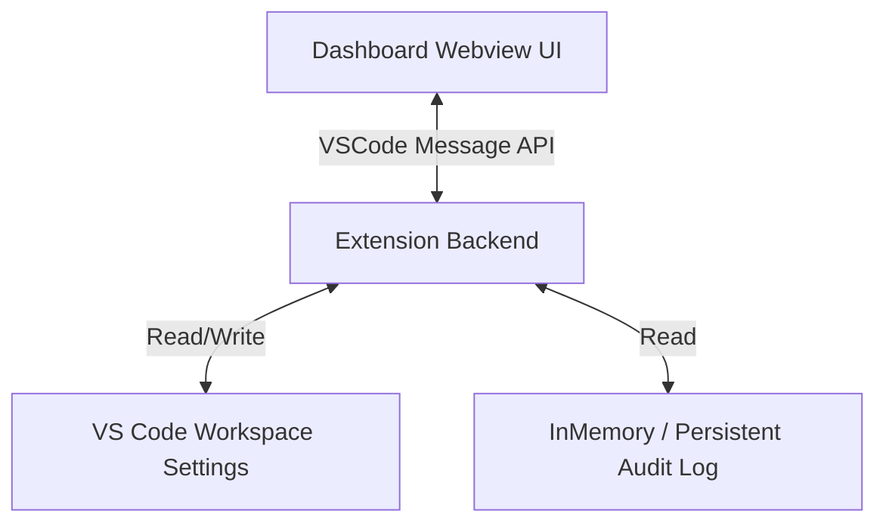

# AntiYolo Future Plans: Advanced Selections & Visual Dashboard

This document tracks the plans to extend the Granular YOLO Extension with a full set of selectable command categories and a premium, interactive VS Code Webview dashboard.

## 🎯 Goal
Give users fine-grained control ("a full set of selections") over exactly which command categories the autonomous agent is allowed to run without prompts. Instead of typing raw whitelist strings, users can toggle predefined categories and manage settings via a high-fidelity dashboard.

---

## 1. Structured Command Categories & Fine-Grained Actions
We will introduce five standard categories of operations. Each category has a primary boolean switch (`allow{Category}Ops`) and a list of allowed fine-grained actions (`allowed{Category}Actions`):

*   📦 **Package Operations (`allowPackageOps`, `allowedPackageActions`)**:
    *   Actions: `install` (npm/yarn/pip install), `ci` (npm ci/clean installs), `update` (npm update/yarn upgrade), `uninstall` (npm uninstall/yarn remove).
*   🧪 **Test Operations (`allowTestOps`, `allowedTestActions`)**:
    *   Actions: `test` (npm test / cargo test / go test), `jest`, `mocha`, `pytest`, `vitest`, `playwright`, `cypress`.
*   🏗️ **Build Operations (`allowBuildOps`, `allowedBuildActions`)**:
    *   Actions: `tsc` (TypeScript compile), `build` (npm run build / webpack / vite), `make` (Makefiles / C++), `gradle` (Gradle builds), `maven` (Maven builds).
*   🌿 **Git Operations (`allowGitOps`, `allowedGitActions`)**:
    *   Actions: `add` (git add), `commit` (git commit), `push` (git push), `checkout` (git checkout), `branch` (git branch), `pull` (git pull), `fetch` (git fetch), `stash` (git stash), `reset` (git reset).
*   📂 **File Operations (`allowFileOps`, `allowedFileActions`)**:
    *   Actions: `mkdir` (create directory), `touch` (create file), `cp` (copy files), `chmod` (change permissions), `chown` (change ownership).

If a category switch is turned ON, only the checked fine-grained actions within that category will be auto-executed. If the category switch is OFF, all commands in that category will fall back to Level 0 (Interactive) prompting.

---

## 2. Interactive Settings Dashboard (Webview)
We will build a VS Code Webview dashboard with rich design aesthetics (dark mode, glassmorphism, responsive elements, and clean animations):

### Key UI Sections
1.  **Header**: Extension state indicator, glowing active status, and "Open Settings" shortcut.
2.  **YOLO Level Selector**: A visual grid of 4 styled cards (0: Interactive, 1: Read-Only, 2: Scoped, 3: Full) with glowing border highlights depending on which level is active.
3.  **Scoped YOLO Category Panel**: A grid of toggle switches representing the 5 predefined command categories, active only when Scoped YOLO is selected.
4.  **Custom Whitelist Manager**: An interactive list of user-defined whitelist patterns, allowing quick addition and deletion.
5.  **Execution Audit Log**: A terminal-like table showing the history of commands executed by the agent, their status (Auto-Executed, Prompted & Approved, Prompted & Denied, Blocked, Timed Out), execution duration, and expandable stdout/stderr outputs.

---

## 3. Implementation Steps & Progressive Disclosure
To keep code size small and focused, we split implementation into distinct, logical modules:

*   **`src/types.ts`**: Update config interfaces and enum selections.
*   **`src/config.ts`**: Update configuration retrieval to read new category boolean flags.
*   **`src/validator.ts`**: Integrate the new category checks into the validation pipeline.
*   **`src/logger.ts`** [NEW]: A dedicated command history logger class that keeps track of the last $N$ commands and their execution results.
*   **`src/dashboard.ts`** [NEW]: Panel coordinator managing the lifecycle of the VS Code Webview panel, serialization, and messaging.
*   **`src/media/dashboard.html`** [NEW]: The HTML, CSS (vanilla CSS dark-mode dashboard), and JS bundle for the Webview UI.
